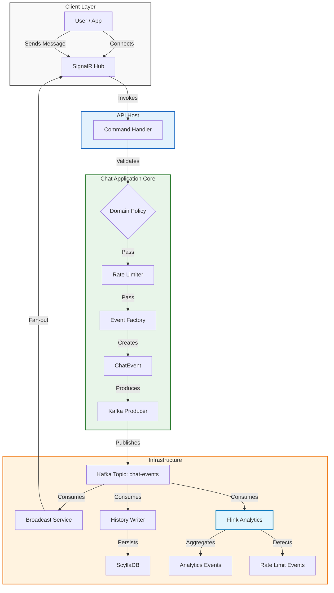

# Chatify


## Table of Contents
- [Overview](#overview)
- [Architecture](#architecture)
- [Request Flow](#request-flow)
- [Getting Started](#getting-started)
- [Development Workflow](#development-workflow)
- [Testing](#testing)
- [Deployment](#deployment)
- [Observability](#observability)
- [Appendix](#appendix)

## Overview
Chatify is a modular monolith built with Clean Architecture and SOLID principles. The project provides a real-time chat API with SignalR hubs, comprehensive middleware for cross-cutting concerns, and a layered architecture that separates domain logic from infrastructure implementation.

## Core Architecture



### Package Structure

```
Chatify.BuildingBlocks
```

```
Chatify.Chat.Domain
```

```
Chatify.Chat.Application
```

```
Chatify.Chat.Infrastructure
```

```
Chatify.ChatApi
```

See [architecture.md](architecture.md) for the detailed architectural overview and module responsibilities.

### Solution Structure & Module Boundaries
Chatify is organized around a modular monolith layout with a dedicated host, a shared kernel, and a chat module that follows Clean Architecture layering. The solution is anchored by `Chatify.sln` with the following structure:

- `src/Hosts/Chatify.ChatApi`: HTTP host that composes application/infrastructure dependencies.
- `src/BuildingBlocks/Chatify.BuildingBlocks`: shared kernel utilities and cross-cutting abstractions.
- `src/Modules/Chat/Chatify.Chat.Domain`: domain model and business rules.
- `src/Modules/Chat/Chatify.Chat.Application`: use cases, application services, and orchestration.
- `src/Modules/Chat/Chatify.Chat.Infrastructure`: data access and integrations for the chat module.
- `tests/Chatify.Chat.UnitTests`: unit tests for the chat module.
- `tests/Chatify.ChatApi.IntegrationTests`: integration tests for the API host and chat module wiring.

Module boundaries are enforced through project references: the domain layer only depends on `BuildingBlocks` (when needed), the application layer depends on domain and shared kernel, infrastructure depends on application/domain/shared kernel, and the host only depends on application/infrastructure/shared kernel.

### Dependency Overview
Chatify manages baseline dependencies centrally in `Directory.Packages.props` to keep versions consistent. Highlights include SignalR for realtime chat, Serilog for logging (console + Elastic), Kafka/Redis/Cassandra clients for infrastructure integrations, and xUnit + FluentAssertions for testing.

### Service Registration
The host's `Program.cs` orchestrates dependency injection through layer-specific extension methods:

```csharp
// BuildingBlocks (clock, correlation)
services.AddSingleton<IClockService, SystemClockService>();
services.AddSingleton<ICorrelationContextAccessor, CorrelationContextAccessor>();

// Infrastructure Options (must be first)
services.AddElasticLoggingChatify(Configuration);

// Infrastructure Providers
services.AddDatabase(Configuration);         // Chat history persistence
services.AddCaching(Configuration);         // Presence, rate limiting, pod identity
services.AddMessageBroker(Configuration);    // Event streaming

// Application Services
services.AddChatifyChatApplication();        // Command handlers

// ASP.NET Core Services
services.AddControllers();
services.AddSignalR();
```

### Middleware Pipeline
The HTTP request pipeline is configured in the following order:

```
1. Developer Exception Page (development only)
2. Global Exception Handling Middleware
   ├─ Uses ExceptionMappingUtility for consistent ProblemDetails
   ├─ Catches all unhandled exceptions
   ├─ Logs with correlation ID to Elasticsearch
   └─ Returns RFC 7807 ProblemDetails
3. Correlation ID Middleware
   ├─ Extracts X-Correlation-ID header
   ├─ Generates new ID if missing
   ├─ Stores in ICorrelationContextAccessor
   └─ Adds to response headers
4. Routing
5. Authorization
6. Endpoints
   ├─ Controllers (/api/*)
   └─ SignalR Hubs (/hubs/chat)
```

### Global Error Handling

Chatify implements comprehensive global error handling across all layers:

#### HTTP Pipeline (Middleware)
- **GlobalExceptionHandlingMiddleware** catches all unhandled exceptions from HTTP requests
- Uses **ExceptionMappingUtility** to map exceptions to RFC 7807 ProblemDetails
- Logs all errors to Elasticsearch with correlation IDs via **ILogService**
- Returns consistent error responses with appropriate HTTP status codes

#### Background Services
Both background services implement two-level exception handling:

1. **Outer Loop (Service Level):** Catches unexpected exceptions, logs to Elasticsearch, and lets Kubernetes restart the service
2. **Inner Loop (Operation Level):** Handles per-operation errors with exponential backoff retry

**ChatHistoryWriterBackgroundService:**
```csharp
// Outer loop - Prevents service termination
try
{
    await ExecuteConsumeLoopAsync(stoppingToken);
}
catch (Exception ex)
{
    _logService.Error(ex, "Fatal error, will restart", context);
    throw; // Let Kubernetes restart
}

// Inner loop - Handles per-operation errors
while (!stoppingToken.IsCancellationRequested)
{
    try
    {
        var result = await _processor.ProcessAsync(message, stoppingToken);
        backoff.Reset(); // Success - reset backoff
    }
    catch (Exception ex) when (IsTransientError(ex))
    {
        _logService.Error(ex, "Transient error, retrying with backoff", context);
        await Task.Delay(backoff.NextDelayWithJitter(), stoppingToken);
    }
}
```

**ChatBroadcastBackgroundService:**
- Similar two-level error handling pattern
- Deserialization errors log payload preview and continue to next message
- All Kafka/SignalR exceptions logged to Elasticsearch
- Exponential backoff prevents overwhelming external services

#### Exception Mapping

**ExceptionMappingUtility** provides centralized exception-to-ProblemDetails mapping:

| Exception Type | HTTP Status | Error Code Pattern |
|----------------|-------------|-------------------|
| ArgumentException, ArgumentNullException | 400 | Validation errors |
| UnauthorizedAccessException | 401 | Authentication/Authorization |
| KeyNotFoundException | 404 | Resource not found |
| InvalidOperationException | 409 | State conflicts |
| TimeoutException | 504 | External timeouts |
| Other exceptions | 500 | Unexpected errors |

**Logging Guarantees:**
- No Kafka/Redis/Scylla exception leaks unlogged
- All background service errors logged to Elasticsearch via ILogService
- Correlation IDs included in all error logs
- Structured context includes partition, offset, consumer group, etc.

## Request Flow

### SignalR Chat Message Flow

```
┌─────────────────────────────────────────────────────────────────────────────┐
│                          Chatify Chat Message Flow                          │
├─────────────────────────────────────────────────────────────────────────────┤
│                                                                             │
│  1. SIGNALR CLIENT CONNECTS                                                 │
│     ┌──────────────┐                                                        │
│     │   Browser/   │                                                        │
│     │   Mobile App │                                                        │
│     └──────┬───────┘                                                        │
│            │ WebSocket connection to /hubs/chat                             │
│            ▼                                                                │
│     ┌──────────────┐                                                        │
│     │ ChatHubService│  ────────────────────────┐                            │
│     │  (SignalR)   │  │ OnConnectedAsync()     │                            │
│     └──────────────┘  │   - Logs connection    │                            │
│                      └─────────────────────────┘                            │
│                                                                             │
│  2. CLIENT JOINS SCOPE                                                      │
│     ┌──────────────┐                                                        │
│     │   Client     │                                                        │
│     └──────┬───────┘                                                        │
│            │ hub.invoke("JoinScopeAsync", "general")                        │
│            ▼                                                                │
│     ┌──────────────┐                                                        │
│     │ ChatHubService│  ────────────────────────┐                            │
│     └──────────────┘  │ Groups.AddToGroupAsync()│                            │
│                      │   - Adds connection to   │                            │
│                      │     "general" group      │                            │
│                      └─────────────────────────┘                            │
│                                                                             │
│  3. CLIENT SENDS MESSAGE                                                    │
│     ┌──────────────┐                                                        │
│     │   Client     │                                                        │
│     └──────┬───────┘                                                        │
│            │ hub.invoke("SendAsync", requestDto)                            │
│            ▼                                                                │
│     ┌─────────────────────────────────────────────────────────────────┐    │
│     │                    MIDDLEWARE PIPELINE                           │    │
│     ├─────────────────────────────────────────────────────────────────┤    │
│     │                                                                 │    │
│     │  CorrelationIdMiddleware                                        │    │
│     │  ├─ Extract/Generate Correlation ID                            │    │
│     │  ├─ Store in ICorrelationContextAccessor                        │    │
│     │  └─ Add to response: X-Correlation-ID                           │    │
│     │                          │                                      │    │
│     │                          ▼                                      │    │
│     │  GlobalExceptionHandlingMiddleware                              │    │
│     │  ├─ Wrap downstream execution in try/catch                      │    │
│     │  ├─ On exception: Log + Return ProblemDetails                   │    │
│     │  └─ On success: Continue to next middleware                     │    │
│     │                          │                                      │    │
│     │                          ▼                                      │    │
│     │  SignalR Hub Invocation (ChatHubService.SendAsync)              │    │
│     │                                                                 │    │
│     └────────────────────────────────┬────────────────────────────────┘    │
│                                      │                                     │
│                                      ▼                                     │
│     ┌─────────────────────────────────────────────────────────────────┐    │
│     │              SendChatMessageCommandHandler                      │    │
│     ├─────────────────────────────────────────────────────────────────┤    │
│     │                                                                 │    │
│     │  1. VALIDATE DOMAIN POLICY                                      │    │
│     │     └─> ChatDomainPolicy.ValidateSenderId()                    │    │
│     │     └─> ChatDomainPolicy.ValidateScopeId()                     │    │
│     │     └─> ChatDomainPolicy.ValidateText()                        │    │
│     │         │                                                       │    │
│     │         ├─ FAIL: Return ResultEntity.Failure(ValidationError)   │    │
│     │         └─ PASS: Continue                                       │    │
│     │                                                                 │    │
│     │  2. CHECK RATE LIMIT                                            │    │
│     │     └─> IRateLimitService.CheckAndIncrementAsync()              │    │
│     │         │                                                       │    │
│     │         ├─ FAIL: Return ResultEntity.Failure(RateLimitExceeded)│    │
│     │         └─ PASS: Continue                                       │    │
│     │                                                                 │    │
│     │  3. CREATE CHAT EVENT                                           │    │
│     │     └─> MessageId = Guid.NewGuid()                              │    │
│     │     └─> CreatedAtUtc = IClockService.GetUtcNow()                │    │
│     │     └─> OriginPodId = IPodIdentityService.PodId                 │    │
│     │         │                                                       │    │
│     │         ▼                                                       │    │
│     │     ChatEventDto {                                              │    │
│     │       MessageId, ScopeType, ScopeId,                            │    │
│     │       SenderId, Text, CreatedAtUtc, OriginPodId                 │    │
│     │     }                                                           │    │
│     │                                                                 │    │
│     │  4. PRODUCE TO MESSAGING SYSTEM                                 │    │
│     │     └─> IChatEventProducerService.ProduceAsync()                │    │
│     │         │                                                       │    │
│     │         ├─ FAIL: Return ResultEntity.Failure(EventProductionFailed)│   │
│     │         └─ SUCCESS: Returns (partition, offset)                 │    │
│     │                                                                 │    │
│     │  5. RETURN SUCCESS                                              │    │
│     │     └─> EnrichedChatEventDto {                                   │    │
│     │           ChatEvent, Partition, Offset                           │    │
│     │         }                                                       │    │
│     │                                                                 │    │
│     └────────────────────────────────┬────────────────────────────────┘    │
│                                      │                                     │
│                                      ▼                                     │
│     ┌─────────────────────────────────────────────────────────────────┐    │
│     │                    BROADCAST TO SCOPE                           │    │
│     ├─────────────────────────────────────────────────────────────────┤    │
│     │                                                                 │    │
│     │  Clients.Group(scopeId).SendAsync("ReceiveMessage", chatEvent)  │    │
│     │                                                                 │    │
│     │  All clients in the scope receive the message in real-time      │    │
│     │                                                                 │    │
│     └─────────────────────────────────────────────────────────────────┘    │
│                                                                             │
└─────────────────────────────────────────────────────────────────────────────┘
```

### Key Components

#### ChatHubService (SignalR Hub)
- **Location**: `src/Hosts/Chatify.ChatApi/Hubs/ChatHubService.cs`
- **Endpoint**: `/hubs/chat`
- **Methods**:
  - `JoinScopeAsync(scopeId)` - Add client to scope group
  - `LeaveScopeAsync(scopeId)` - Remove client from scope group
  - `SendAsync(requestDto)` - Process and broadcast message
- **Lifecycle Hooks**:
  - `OnConnectedAsync()` - Log client connection
  - `OnDisconnectedAsync(exception)` - Log client disconnection

#### Middleware
- **CorrelationIdMiddleware**: Ensures every request has a correlation ID for distributed tracing
- **GlobalExceptionHandlingMiddleware**: Catches exceptions and returns ProblemDetails responses

#### Command Handler
- **SendChatMessageCommandHandler**: Orchestrates message validation, rate limiting, event creation, and production

## Getting Started
Placeholders only. Future steps will include build and run instructions for Chatify.

## Development Workflow
Placeholders only. Future steps will describe local development workflows for Chatify.

## Testing

### Test Structure

Chatify has two test projects:

- **Chatify.Chat.UnitTests** - Unit tests for domain logic and application handlers
- **Chatify.Api.IntegrationTests** - Integration tests for the API using WebApplicationFactory

### Running Unit Tests

Unit tests validate domain policies and command handler behavior without external infrastructure dependencies.

```bash
# Run all unit tests
dotnet test tests/Chatify.Chat.UnitTests/Chatify.Chat.UnitTests.csproj

# Run with detailed output
dotnet test tests/Chatify.Chat.UnitTests/Chatify.Chat.UnitTests.csproj --logger "console;verbosity=detailed"

# Run specific test
dotnet test tests/Chatify.Chat.UnitTests/Chatify.Chat.UnitTests.csproj --filter "FullyQualifiedName~ChatDomainPolicyTests"

# Run with code coverage
dotnet test tests/Chatify.Chat.UnitTests/Chatify.Chat.UnitTests.csproj --collect:"XPlat Code Coverage"
```

**Unit Test Coverage:**

- `ChatDomainPolicyTests` - Validates domain policy enforcement for:
  - Scope ID validation (null, empty, whitespace, length limits)
  - Message text validation (null, length limits)
  - Sender ID validation (null, empty, whitespace, length limits)
  - Origin pod ID validation (null, empty, whitespace, length limits)

- `SendChatMessageCommandHandlerTests` - Validates command handler behavior for:
  - Successful message send with valid inputs
  - Domain validation failures
  - Rate limit exceeded scenarios
  - Event production failures
  - Pod identity validation failures
  - DirectMessage scope handling
  - Empty text handling

### Running Integration Tests

Integration tests use WebApplicationFactory to spin up the API in memory with the in-memory message broker enabled.

```bash
# Run all integration tests
dotnet test tests/Chatify.Api.IntegrationTests/Chatify.Api.IntegrationTests.csproj

# Run with detailed output
dotnet test tests/Chatify.Api.IntegrationTests/Chatify.Api.IntegrationTests.csproj --logger "console;verbosity=detailed"

# Run specific test
dotnet test tests/Chatify.Api.IntegrationTests/Chatify.Api.IntegrationTests.csproj --filter "FullyQualifiedName~ChatApiIntegrationTests"
```

**Integration Test Coverage:**

- Health check endpoint
- Successful message send with enriched event response
- Validation failures (empty scope ID, text exceeding max length)
- Partition ordering (same scope goes to same partition)
- DirectMessage scope handling

**In-Memory Message Broker:**

Integration tests use the `Chatify:MessageBroker:UseInMemoryBroker=true` configuration flag to bypass Kafka and use the `InMemoryChatEventProducerService`. This provides:

- No external infrastructure requirements for tests
- Deterministic test behavior
- Fast test execution
- Event verification through `GetEventsByPartition()` and `GetAllEvents()` methods

### Running All Tests

```bash
# Run all tests in the solution
dotnet test

# Run all tests with detailed output
dotnet test --logger "console;verbosity=detailed"

# Run all tests with code coverage
dotnet test --collect:"XPlat Code Coverage"
```

### Test Configuration

The in-memory message broker is configured via the `Chatify:MessageBroker:UseInMemoryBroker` setting:

```json
{
  "Chatify": {
    "MessageBroker": {
      "UseInMemoryBroker": true,
      "BootstrapServers": "localhost:9092",
      "TopicName": "chat-events",
      "Partitions": 3,
      "BroadcastConsumerGroupPrefix": "chatify-broadcast"
    }
  }
}
```

When `UseInMemoryBroker` is true:
- `InMemoryChatEventProducerService` is registered instead of `ChatEventProducerService`
- Kafka-specific configuration (BootstrapServers, TopicName, etc.) is not validated
- Events are stored in memory for test verification

### Test Best Practices

1. **Use Moq for dependencies** - The unit tests use Moq to mock services like `IChatEventProducerService`, `IRateLimitService`, `IPodIdentityService`, and `IClockService`

2. **Arrange-Act-Assert pattern** - All tests follow the AAA pattern for clarity and maintainability

3. **Test names describe behavior** - Test method names clearly describe what is being tested and the expected outcome

4. **No external dependencies** - Unit tests should never require external infrastructure (Kafka, Redis, ScyllaDB, Elasticsearch)

5. **Deterministic tests** - All tests should be deterministic and produce the same results on every run

6. **Fast execution** - Tests should run quickly to enable rapid development feedback

### SignalR Hub Testing with wscat

**Note:** `wscat` does not support the SignalR protocol directly. Use SignalR client libraries for proper testing. The examples below use standard WebSocket clients with SignalR-compatible messages.

#### Using the .NET SignalR Client

```csharp
using Microsoft.AspNetCore.SignalR.Client;

// Create connection
var connection = new HubConnectionBuilder()
    .WithUrl("http://localhost:5000/hubs/chat")
    .Build();

// Register message handler
connection.On<ChatEventDto>("ReceiveMessage", (chatEvent) => {
    Console.WriteLine($"[{chatEvent.ScopeId}] {chatEvent.SenderId}: {chatEvent.Text}");
});

// Start connection
await connection.StartAsync();

// Join a scope
await connection.InvokeAsync("JoinScopeAsync", "general");

// Send a message
await connection.InvokeAsync("SendAsync", new ChatSendRequestDto {
    ScopeType = ChatScopeTypeEnum.Channel,
    ScopeId = "general",
    Text = "Hello, Chatify!"
});
```

#### Using JavaScript/TypeScript SignalR Client

```javascript
// Install: npm install @microsoft/signalr

import * as signalR from '@microsoft/signalr';

// Build connection
const connection = new signalR.HubConnectionBuilder()
    .withUrl('/hubs/chat')
    .build();

// Deduplication for at-least-once delivery
const seenMessages = new Set();

// Register message handler
connection.on('ReceiveMessage', (event) => {
    // Client-side deduplication
    if (seenMessages.has(event.messageId)) {
        console.log(`Duplicate skipped: ${event.messageId}`);
        return;
    }
    seenMessages.add(event.messageId);

    // Prune old entries to prevent memory bloat
    if (seenMessages.size > 10000) {
        const oldest = seenMessages.keys().next().value;
        seenMessages.delete(oldest);
    }

    console.log(`[${event.scopeId}] ${event.senderId}: ${event.text}`);
});

// Start connection
await connection.start();

// Join a scope
await connection.invoke('JoinScopeAsync', 'general');

// Send a message
await connection.invoke('SendAsync', {
    scopeType: 0, // Channel
    scopeId: 'general',
    text: 'Hello, Chatify!'
});
```

#### Using Browser DevTools Console

```javascript
// Open browser DevTools console on a page that loads SignalR

// Create connection
const connection = new signalR.HubConnectionBuilder()
    .withUrl('http://localhost:5000/hubs/chat')
    .configureLogging(signalR.LogLevel.Information)
    .build();

// Message handler
connection.on('ReceiveMessage', (event) => {
    console.log('Received:', event);
    // Display in UI...
});

// Start and join
connection.start().then(() => {
    console.log('Connected');
    return connection.invoke('JoinScopeAsync', 'general');
}).then(() => {
    console.log('Joined scope: general');
});
```

### Kafka Topic Testing with kcat (formerly kafkacat)

```bash
# Install: apt-get install kafkacat (Debian/Ubuntu)
# Or: brew install kcat (macOS)

# Consume from chat-events topic
kcat -C -b localhost:9092 -t chat-events -f 'Partition(%p) Offset(%o) Key(%k): %s\n'

# Produce a test message
echo '{"messageId":"123e4567-e89b-12d3-a456-426614174000","scopeType":0,"scopeId":"general","senderId":"test-user","text":"Hello from kcat","createdAtUtc":"2026-01-15T10:30:00Z","originPodId":"test-pod"}' | \
  kcat -P -b localhost:9092 -t chat-events -k general
```

### Verifying Fan-Out Broadcast

To verify the fan-out consumption pattern works across multiple pods:

1. **Deploy multiple ChatApi pods** (e.g., 3 replicas)

2. **Connect to each pod** with a SignalR client and join the same scope:

```javascript
// Client 1 - connects to Pod A
// Client 2 - connects to Pod B
// Client 3 - connects to Pod C

// All join the same scope
await connection.invoke('JoinScopeAsync', 'general');
```

3. **Send a message from any client**:

```javascript
await connection.invoke('SendAsync', {
    scopeType: 0,
    scopeId: 'general',
    text: 'Testing fan-out broadcast!'
});
```

4. **Verify all clients receive the message**, regardless of which pod they're connected to.

5. **Check logs** to see each pod's consumer independently receiving and broadcasting:

```bash
# View logs for a specific pod
kubectl logs -f deployment/chatify-chat-api -c chatify-chat-api | grep "ChatBroadcastBackgroundService"
```

Expected output pattern:
```
ChatBroadcastBackgroundService starting. ConsumerGroupId: chatify-broadcast-chat-api-7d9f4c5b6d-abc12...
Broadcasting chat event xxx to scope general (partition 0, offset 42)...
Successfully broadcasted message xxx to scope general
```

## Deployment

### Prerequisites

- [kind](https://kind.sigs.k8s.io/) (Kubernetes in Docker) v0.20.0 or later
- [kubectl](https://kubernetes.io/docs/tasks/tools/) v1.27.0 or later
- [Docker](https://www.docker.com/) Desktop or Engine

### Local Deployment with kind

Chatify provides Kubernetes manifests optimized for local development using kind. The deployment includes:

- Namespace `chatify`
- ChatApi deployment with 3 replicas
- NodePort service for external access
- ConfigMap with infrastructure endpoints (Kafka, Redis, Scylla, Elasticsearch)
- Health probes (liveness, readiness, startup)
- Pod identity injection via `POD_NAME` environment variable

#### Deployment Architecture

```
┌─────────────────────────────────────────────────────────────────────────────┐
│                          kind Cluster: chatify                              │
├─────────────────────────────────────────────────────────────────────────────┤
│                                                                             │
│  ┌──────────────────────────────────────────────────────────────────────┐  │
│  │                      Namespace: chatify                              │  │
│  │                                                                      │  │
│  │  ┌────────────────────────────────────────────────────────────────┐  │  │
│  │  │  Deployment: chatify-chat-api (replicas: 3)                    │  │
│  │  │  ┌──────────┐  ┌──────────┐  ┌──────────┐                     │  │  │
│  │  │  │  Pod-1   │  │  Pod-2   │  │  Pod-3   │                     │  │  │
│  │  │  │ POD_NAME │  │ POD_NAME │  │ POD_NAME │                     │  │  │
│  │  │  │ injected │  │ injected │  │ injected │                     │  │  │
│  │  │  └────┬─────┘  └────┬─────┘  └────┬─────┘                     │  │  │
│  │  │       │             │             │                            │  │  │
│  │  └───────┼─────────────┼─────────────┼────────────────────────────┘  │  │
│  │          │             │             │                               │  │
│  │          └─────────────┼─────────────┘                               │  │
│  │                        ▼                                            │  │
│  │  ┌────────────────────────────────────────────────────────────────┐  │  │
│  │  │  Service: chatify-chat-api (NodePort: 30080/30443)             │  │  │
│  │  └────────────────────────────────────────────────────────────────┘  │  │
│  │                                                                      │  │
│  │  ┌────────────────────────────────────────────────────────────────┐  │  │
│  │  │  ConfigMap: chatify-chat-api-config                             │  │  │
│  │  │  - Kafka: chatify-kafka:9092                                    │  │  │
│  │  │  - Redis: chatify-redis:6379                                    │  │  │
│  │  │  - Scylla: chatify-scylla:9042                                  │  │  │
│  │  │  - Elastic: http://chatify-elastic:9200                         │  │  │
│  │  └────────────────────────────────────────────────────────────────┘  │  │
│  │                                                                      │  │
│  └──────────────────────────────────────────────────────────────────────┘  │
│                                                                             │
│  Port Mappings (host -> container):                                         │
│  - 8080 -> 30080 (HTTP)                                                     │
│  - 8443 -> 30443 (HTTPS)                                                    │
│  - 9092 -> 30092 (Kafka)                                                    │
│  - 9042 -> 30042 (ScyllaDB)                                                 │
│  - 6379 -> 30079 (Redis)                                                    │
│  - 9200 -> 30020 (Elasticsearch)                                            │
│  - 5601 -> 30561 (Kibana)                                                   │
│  - 8081 -> 3080 (AKHQ)                                                      │
│  - 8082 -> 3081 (Flink Web UI)                                              │
│                                                                             │
└─────────────────────────────────────────────────────────────────────────────┘
```

#### Quick Start

The easiest way to get started with Chatify is using the deployment scripts:

```bash
# Bootstrap entire environment (creates kind cluster and deploys all services)
./scripts/up.sh
```

This script will:
1. Create a kind cluster with proper port mappings
2. Deploy infrastructure services (Kafka, Redis, Elasticsearch, ScyllaDB, Flink)
3. Deploy management UIs (AKHQ, Kibana)
4. Deploy the Chat API application
5. Wait for all services to be ready

**Access the services:**

Services are accessible via the following ports:
- Chat API (HTTP):  http://localhost:8080
- Chat API (HTTPS): https://localhost:8443
- Kafka:            localhost:9092
- ScyllaDB:         localhost:9042
- Redis:            localhost:6379
- Elasticsearch:    http://localhost:9200
- AKHQ (Kafka UI):  http://localhost:8081
- Kibana:           http://localhost:5601
- Flink Web UI:     http://localhost:8082

**Other useful commands:**

```bash
# Check deployment status (pods, services, events)
./scripts/status.sh

# View logs for Chat API
./scripts/logs-chatify.sh

# Port forward services for local access
./scripts/port-forward.sh

# Tear down environment and delete kind cluster
./scripts/down.sh
```

#### Manual Deployment (Advanced)

If you prefer to deploy components manually:

1. **Create the kind cluster:**

```bash
kind create cluster --config deploy/kind/kind-cluster.yaml
```

2. **Apply Kubernetes manifests in order:**

```bash
# Apply namespace
kubectl apply -f deploy/k8s/00-namespace.yaml

# Deploy infrastructure components
kubectl apply -f deploy/k8s/kafka/
kubectl apply -f deploy/k8s/redis/
kubectl apply -f deploy/k8s/elastic/
kubectl apply -f deploy/k8s/scylla/
kubectl apply -f deploy/k8s/flink/
kubectl apply -f deploy/k8s/akhq/

# Deploy Chat API application
kubectl apply -f deploy/k8s/chat-api/
```

3. **Verify deployment:**

```bash
# Check pods
kubectl get pods -n chatify

# Check services
kubectl get svc -n chatify

# Check logs
kubectl logs -f deployment/chatify-chat-api -n chatify
```

4. **Access ChatApi:**

```bash
# Port forward to local port
kubectl port-forward -n chatify svc/chatify-chat-api 8080:80

# Or access via NodePort (from kind)
curl http://localhost:8080/health/live
```

#### Health Endpoints

ChatApi exposes the following health endpoints:

| Endpoint | Purpose |
|----------|---------|
| `/health/live` | Liveness probe - checks if container is alive |
| `/health/ready` | Readiness probe - checks if container can serve traffic |
| `/health/startup` | Startup probe - checks if application has started |

#### Pod Identity

Each pod receives its identity via the `POD_NAME` environment variable, which is injected using Kubernetes `fieldRef`:

```yaml
env:
  - name: POD_NAME
    valueFrom:
      fieldRef:
        fieldPath: metadata.name
```

This identity is used by `IPodIdentityService` to track message origins across distributed pods.

#### Configuration Reference

The ConfigMap `chatify-chat-api-config` contains all infrastructure endpoints:

| Configuration | Description | Default Value |
|---------------|-------------|---------------|
| `CHATIFY__LOGGING__URI` | Elasticsearch endpoint | `http://chatify-elastic:9200` |
| `CHATIFY__DATABASE__CONTACTPOINTS` | ScyllaDB contact points | `chatify-scylla` |
| `CHATIFY__DATABASE__PORT` | ScyllaDB port | `9042` |
| `CHATIFY__DATABASE__KEYSPACE` | ScyllaDB keyspace | `chatify` |
| `CHATIFY__CACHING__CONNECTIONSTRING` | Redis endpoint | `chatify-redis:6379` |
| `CHATIFY__MESSAGEBROKER__BOOTSTRAPSERVERS` | Kafka bootstrap servers | `chatify-kafka:9092` |
| `CHATIFY__MESSAGEBROKER__TOPICNAME` | Kafka topic for chat events | `chat-events` |
| `CHATIFY__MESSAGEBROKER__PARTITIONS` | Kafka topic partitions | `3` |

#### Infrastructure Services

The following infrastructure services must be deployed before ChatApi:

1. **Kafka** - Message broker for chat events
2. **Redis** - Caching for presence tracking, rate limiting, and pod identity management
3. **ScyllaDB** - NoSQL database for chat history
4. **Elasticsearch** - Log aggregation and search
5. **Kibana** - Log visualization and analysis
6. **AKHQ** - Kafka management UI
7. **Flink** - Stream processing for advanced analytics and event aggregation

##### Kafka Deployment (Redpanda)

Chatify uses Redpanda as the Kafka-compatible message broker. Redpanda provides full Kafka protocol compatibility with simplified deployment and management.

**Deploy Kafka:**

```bash
# Deploy Kafka StatefulSet
kubectl apply -f deploy/k8s/kafka/10-statefulset.yaml

# Wait for Kafka to be ready
kubectl wait --for=condition=ready pod -l app.kubernetes.io/name=chatify-kafka -n chatify --timeout=120s

# Initialize the chat-events topic
kubectl apply -f deploy/k8s/kafka/20-topic-init-job.yaml

# Verify topic creation
kubectl logs -n chatify job/chatify-kafka-topic-init
```

**Kafka Configuration:**
- **Topic**: `chat-events`
- **Partitions**: 3 (configurable via ConfigMap)
- **Replication Factor**: 1
- **Bootstrap Servers**: `chatify-kafka:9092` (internal), `localhost:9092` (via NodePort)

##### AKHQ Deployment

AKHQ (formerly KafkaHQ) is a Kafka GUI for managing Apache Kafka, Redpanda, and Zookeeper. It provides a web UI for viewing topics, partitions, consumers, and messages.

**Deploy AKHQ:**

```bash
kubectl apply -f deploy/k8s/akhq/10-deployment.yaml

# Wait for AKHQ to be ready
kubectl wait --for=condition=ready pod -l app.kubernetes.io/name=chatify-akhq -n chatify --timeout=120s
```

**Access AKHQ:**

```bash
# Port forward to local port
kubectl port-forward -n chatify svc/chatify-akhq-nodeport 8081:8080

# Or access via NodePort (from kind)
curl http://localhost:8081
```

Open your browser to `http://localhost:8081` to access the AKHQ UI.

##### Verifying Kafka and AKHQ

**1. Verify Kafka is running:**

```bash
kubectl get pods -n chatify -l app.kubernetes.io/name=chatify-kafka
kubectl get svc -n chatify -l app.kubernetes.io/name=chatify-kafka
```

**2. Verify topic creation via AKHQ:**

In the AKHQ UI:
1. Navigate to the **chatify-kafka** connection
2. Click on **Topics** in the left sidebar
3. Verify the `chat-events` topic exists with 3 partitions
4. Click on the topic to view partition details and consumer groups

**3. Produce a test message via AKHQ:**

In the AKHQ UI:
1. Navigate to **Topics** -> **chat-events**
2. Click the **Produce** button
3. Enter a key (e.g., `general`) and value (JSON):
   ```json
   {
     "messageId": "123e4567-e89b-12d3-a456-426614174000",
     "scopeType": 0,
     "scopeId": "general",
     "senderId": "test-user",
     "text": "Hello from AKHQ!",
     "createdAtUtc": "2026-01-16T10:30:00Z",
     "originPodId": "akhq-test"
   }
   ```
4. Click **Produce** to send the message

**4. Verify message in AKHQ:**

In the AKHQ UI:
1. Navigate to **Topics** -> **chat-events**
2. Click the **Messages** tab
3. View the message in partition 0 (or based on key routing)
4. Expand the message to view full JSON content, key, timestamp, offset, and partition

**5. Monitor consumer groups:**

In the AKHQ UI:
1. Navigate to **Consumers** in the left sidebar
2. View active consumer groups:
   - `chatify-chat-history-writer` - Chat history persistence
   - `chatify-broadcast-*` - Broadcast consumers for each API pod
3. Click on a consumer group to view:
   - Lag (messages pending consumption)
   - Offset positions per partition
   - Member assignments

**6. Verify topic partitions:**

In the AKHQ UI:
1. Navigate to **Topics** -> **chat-events**
2. View the **Partitions** tab showing:
   - Partition 0, 1, 2
   - Replication factor
   - In-sync replica count
   - Total messages per partition

##### External Kafka Access

To access Kafka from the host machine for testing:

```bash
# Via kcat (kafkacat)
kcat -C -b localhost:9092 -t chat-events -f 'Partition(%p) Offset(%o) Key(%k): %s\n'

# Or produce a test message
echo '{"messageId":"test","scopeType":0,"scopeId":"general","senderId":"test","text":"Hello","createdAtUtc":"2026-01-16T00:00:00Z","originPodId":"test"}' | \
  kcat -P -b localhost:9092 -t chat-events -k general
```

Note: Port mapping `9092 -> 30092` is configured in `deploy/kind/kind-cluster.yaml`.

##### Redis Deployment

Redis serves as the caching layer for Chatify, providing low-latency data storage for:
- **Presence Tracking**: Real-time user online/offline status across SignalR connections
- **Rate Limiting**: Per-user message rate limits to prevent spam and abuse
- **Pod Identity Management**: Distributed coordination across multiple ChatApi pods

**Deploy Redis:**

```bash
# Deploy Redis deployment with services
kubectl apply -f deploy/k8s/redis/10-redis-deployment.yaml

# Wait for Redis to be ready
kubectl wait --for=condition=ready pod -l app.kubernetes.io/name=chatify-redis -n chatify --timeout=120s

# Verify Redis is running
kubectl get pods -n chatify -l app.kubernetes.io/name=chatify-redis
kubectl get svc -n chatify -l app.kubernetes.io/name=chatify-redis
```

**Redis Configuration:**
- **Image**: `redis:8.0-alpine`
- **Memory Limit**: 256MB with `allkeys-lru` eviction policy
- **Persistence**: AOF (Append Only File) with everysec fsync
- **Port**: 6379 (internal), 30079 (via NodePort)
- **Service**: `chatify-redis:6379` (ClusterIP), `chatify-redis-nodeport` (NodePort)

**Redis Data Structures:**

Chatify uses Redis for the following data patterns:

```
# Presence Tracking: Key-Value with TTL
SET user:{userId}:presence {podId}:{connectionId} EX 300

# Rate Limiting: String with increment
INCR user:{userId}:ratelimit:60s
EXPIRE user:{userId}:ratelimit:60s 60

# Pod Identity: Simple key-value
SET pod:{podName}:identity {metadata} EX 3600
```

**Testing Redis:**

```bash
# Connect to Redis from host machine
redis-cli -h localhost -p 30079

# Or via kubectl port-forward
kubectl port-forward -n chatify svc/chatify-redis-nodeport 6379:30079
redis-cli -h localhost -p 6379

# Test Redis operations
redis-cli -h localhost -p 30079
> PING
PONG
> SET test-key "Hello Redis"
OK
> GET test-key
"Hello Redis"
> KEYS user:*
1) "user:123:presence"
2) "user:456:ratelimit:60s"
```

**Monitoring Redis:**

```bash
# View Redis logs
kubectl logs -f -n chatify deployment/chatify-redis

# Check Redis info
kubectl exec -n chatify deployment/chatify-redis -- redis-cli INFO

# Monitor Redis commands in real-time
kubectl exec -n chatify deployment/chatify-redis -- redis-cli MONITOR
```

**Production Considerations:**

For production deployments, consider:
- **Redis Sentinel** for high availability and automatic failover
- **Redis Cluster** for horizontal scaling and data sharding
- **Persistent volumes** instead of emptyDir for data durability
- **Memory optimization** based on actual usage patterns
- **Security**: Enable AUTH and TLS for production environments

##### ScyllaDB Deployment

ScyllaDB is a high-performance, distributed NoSQL database compatible with Apache Cassandra. Chatify uses ScyllaDB for persistent chat history storage with excellent write performance and linear scalability.

**Deploy ScyllaDB:**

```bash
# Deploy ScyllaDB StatefulSet with services
kubectl apply -f deploy/k8s/scylla/10-scylla-config.yaml
kubectl apply -f deploy/k8s/scylla/20-scylla-statefulset.yaml
kubectl apply -f deploy/k8s/scylla/30-scylla-service.yaml

# Wait for ScyllaDB to be ready
kubectl wait --for=condition=ready pod -l app.kubernetes.io/name=chatify-scylla -n chatify --timeout=300s

# Note: Database schema is managed via code-first migrations
# Keyspace is created on application startup IF it doesn't exist
# Tables and other schema objects are created via migrations on startup
# See the "Schema Migrations" section below for details
```

**ScyllaDB Configuration:**
- **Image**: `scylladb/scylla:5.4.0`
- **Developer Mode**: Enabled for kind/local development
- **Memory**: 1GB (configurable via resources)
- **Storage**: 5Gi persistent volume
- **Port**: 9042 (CQL), 30042 (via NodePort)
- **Service**: `chatify-scylla:9042` (ClusterIP), `chatify-scylla-nodeport` (NodePort)

**Database Schema:**

The ScyllaDB schema initialization creates the following:

**Keyspace: `chatify`**
- Replication Strategy: SimpleStrategy with RF=1 (development)
- Durable writes: Enabled

**Table: `chat_messages`**

| Column | Type | Description |
|--------|------|-------------|
| `scope_id` | text | Partition key: Composite scope identifier (format: "ScopeType:ScopeId") |
| `created_at_utc` | timestamp | Clustering key: Message creation timestamp (ASC order) |
| `message_id` | uuid | Clustering key: Unique message identifier |
| `sender_id` | text | User/service identifier who sent the message |
| `text` | text | Message content |
| `origin_pod_id` | text | Pod that originated the message |
| `broker_partition` | int | Kafka partition where message was produced |
| `broker_offset` | bigint | Kafka offset of the message |

**Primary Key Design:**
- **Partition Key**: `(scope_id)` - Groups all messages in a scope together for efficient queries
- **Clustering Key**: `(created_at_utc ASC, message_id)` - Time-based ordering with UUID for uniqueness

**Table Options:**
- `gc_grace_seconds`: 864000 (10 days)
- `compaction`: SizeTieredCompactionStrategy
- `compression`: LZ4Compressor

**Schema Migrations:**

Chatify uses a **code-first schema migration system** for ScyllaDB. Migrations are implemented as C# classes that execute CQL statements during application startup, similar to how EF Core manages migrations but tailored for ScyllaDB.

**Migration Architecture:**

```
┌─────────────────────────────────────────────────────────────────────────────┐
│                    ScyllaDB Schema Migration System                         │
├─────────────────────────────────────────────────────────────────────────────┤
│                                                                             │
│  1. MIGRATION CLASSES (Code-First)                                          │
│     ┌─────────────────────────────────────────────────────────────────┐    │
│     │  Each module owns: Migrations/{ModuleName}/ in Infrastructure    │    │
│     │                                                                     │    │
│     │  public class V001_CreateChatMessagesTable : IScyllaSchemaMigration │    │
│     │  {                                                                   │    │
│     │      string Name => "V001_CreateChatMessagesTable";                  │    │
│     │      string AppliedBy => "Chatify.Chat.Infrastructure";             │    │
│     │                                                                     │    │
│     │      Task ApplyAsync(ISession session, CancellationToken ct)          │    │
│     │      {                                                               │    │
│     │          var cql = "CREATE TABLE IF NOT EXISTS...";                   │    │
│     │          return session.ExecuteAsync(new SimpleStatement(cql), ct);  │    │
│     │      }                                                               │    │
│     │  }                                                                   │    │
│     └─────────────────────────────────────────────────────────────────┘    │
│                                                                             │
│  2. MIGRATION HISTORY TABLE                                                │
│     ┌─────────────────────────────────────────────────────────────────┐    │
│     │  Table: schema_migrations (configurable via Scylla options)      │    │
│     │  Columns:                                                          │    │
│     │    - migration_name (text, PRIMARY KEY)                            │    │
│     │    - applied_by (text)                                             │    │
│     │    - applied_at_utc (timestamp)                                    │    │
│     │                                                                     │    │
│     │  Purpose: Track which migrations have been applied                  │    │
│     │  Similar to: __EFMigrationsHistory in EF Core                      │    │
│     └─────────────────────────────────────────────────────────────────┘    │
│                                                                             │
│  3. MIGRATION SERVICE                                                      │
│     ┌─────────────────────────────────────────────────────────────────┐    │
│     │  ScyllaSchemaMigrationService                                      │    │
│     │  ────────────────────────────────────────────────────────────  │    │
│     │  Responsibilities:                                                  │    │
│     │  - Discover all IScyllaSchemaMigration implementations             │    │
│     │  - Query schema_migrations table for applied migrations           │    │
│     │  - Filter pending migrations (not in history table)                │    │
│     │  - Apply migrations in order (alphabetical by name)                │    │
│     │  - Record each applied migration in history table                  │    │
│     │  - Handle errors (fail-fast or continue based on config)           │    │
│     └─────────────────────────────────────────────────────────────────┘    │
│                                                                             │
│  4. STARTUP BEHAVIOR                                                       │
│     ┌─────────────────────────────────────────────────────────────────┐    │
│     │  Configuration: Chatify:Scylla:ApplySchemaOnStartup               │    │
│     │                                                                     │    │
│     │  When true (default):                                               │    │
│     │    1. Application starts                                            │    │
│     │    2. AddScyllaChatify creates keyspace IF NOT EXISTS               │    │
│     │    3. AddScyllaChatify connects to keyspace                         │    │
│     │    4. Migration background service runs                             │    │
│     │    5. Pending migrations are applied                                │    │
│     │    6. Application begins handling requests                         │    │
│     │                                                                     │    │
│     │  When false:                                                        │    │
│     │    - Keyspace must exist (connection will fail if missing)          │    │
│     │    - Migrations must be applied manually                            │    │
│     │    - Useful for production environments with manual control         │    │
│     └─────────────────────────────────────────────────────────────────┘    │
│                                                                             │
└─────────────────────────────────────────────────────────────────────────────┘
```

**Configuration Keys:**

```json
{
  "Chatify": {
    "Scylla": {
      "Keyspace": "chatify",
      "ApplySchemaOnStartup": true,
      "SchemaMigrationTableName": "schema_migrations",
      "FailFastOnSchemaError": true
    }
  }
}
```

| Configuration Key | Type | Default | Description |
|-------------------|------|---------|-------------|
| `Keyspace` | string | "chatify" | Target keyspace for migrations |
| `ApplySchemaOnStartup` | boolean | true | Auto-apply migrations on startup |
| `SchemaMigrationTableName` | string | "schema_migrations" | Table name for migration history |
| `FailFastOnSchemaError` | boolean | true | Stop startup if migration fails |

**Existing Migrations:**

The Chat module includes the following migrations:

| Migration ID | Module | Description | Location |
|--------------|--------|-------------|----------|
| `0001_init_chat` | Chat | Creates chat_messages table (keyspace created by AddScyllaChatify) | `src/Modules/Chat/Chatify.Chat.Infrastructure/Migrations/Chat/InitChatMigration.cs` |

**Note:** The keyspace is created automatically by `AddScyllaChatify` during application startup (via `EnsureKeyspaceExistsAsync`), before migrations run. The `0001_init_chat` migration creates the `chat_messages` table.

**Creating a New Migration:**

1. **Create migration class** in `Migrations/{ModuleName}/`:
   ```csharp
   using Cassandra;

   namespace Chatify.Chat.Infrastructure.Migrations.Chat;

   /// <summary>
   /// Example migration for adding a new index.
   /// </summary>
   public sealed class V002_AddMessageIndex : IScyllaSchemaMigration
   {
       /// <inheritdoc/>
       public string ModuleName => "Chat";

       /// <inheritdoc/>
       public string MigrationId => "0002_add_message_index";

       /// <inheritdoc/>
       public Task ApplyAsync(ISession session, CancellationToken cancellationToken)
       {
           var cql = "CREATE INDEX IF NOT EXISTS ON chatify.chat_messages (sender_id);";
           var statement = new SimpleStatement(cql);
           return session.ExecuteAsync(statement, cancellationToken);
       }

       /// <inheritdoc/>
       public Task RollbackAsync(ISession session, CancellationToken cancellationToken)
       {
           var cql = "DROP INDEX IF EXISTS chatify.chat_messages_sender_id_idx;";
           var statement = new SimpleStatement(cql);
           return session.ExecuteAsync(statement, cancellationToken);
       }
   }
   ```

2. **Register migration service** in `Program.cs`:
   ```csharp
   builder.Services.AddScyllaSchemaMigrationsChatify(builder.Configuration);
   ```

3. **Run the application** - migrations are applied automatically on startup

   Note: The migration service is already registered in `Program.cs`. New migrations
   implementing `IScyllaSchemaMigration` are automatically discovered via reflection.

**Migration Naming Convention:**

- Use version prefix: `V001_`, `V002_`, `V003_`, etc.
- Zero-padding ensures correct alphabetical ordering
- Descriptive name after version: `CreateChatMessagesTable`, `AddUserPresenceTable`
- Example: `V001_CreateChatMessagesTable`, `V002_AddIndexes`, `V003_CreateMaterializedView`

**Checking Applied Migrations:**

```bash
# Connect to ScyllaDB
cqlsh localhost --port 30042

# Query migration history
SELECT * FROM chatify.schema_migrations;

# Expected output:
# module_name | migration_id     | applied_at_utc
#-------------+------------------+--------------------------
# Chat        | 0001_init_chat   | 2026-01-16 10:30:00.000Z
```

**Best Practices:**

1. **Use IF NOT EXISTS**: Make migrations idempotent by using `IF NOT EXISTS` clauses
2. **One change per migration**: Keep migrations focused on a single schema change
3. **Test locally**: Always test migrations in development before deploying
4. **Version control**: Migrations are part of the codebase and version controlled
5. **Never modify applied migrations**: Create new migrations instead
6. **Use transactions for data**: Use lightweight transactions (LWT) for data consistency

**Testing ScyllaDB:**

```bash
# Connect to ScyllaDB from host machine
cqlsh localhost --port 30042

# Or via kubectl port-forward
kubectl port-forward -n chatify svc/chatify-scylla-nodeport 9042:30042
cqlsh localhost --port 9042

# Query the schema
DESCRIBE KEYSPACES;
DESCRIBE KEYSPACE chatify;

# Query chat messages
SELECT * FROM chatify.chat_messages LIMIT 10;

# Query messages for a specific scope
SELECT * FROM chatify.chat_messages
WHERE scope_id = 'Channel:general'
LIMIT 100;
```

**Monitoring ScyllaDB:**

```bash
# View ScyllaDB logs
kubectl logs -f -n chatify statefulset/chatify-scylla

# Check ScyllaDB status
kubectl exec -n chatify statefulset/chatify-scylla -- nodetool status

# View table statistics
kubectl exec -n chatify statefulset/chatify-scylla -- nodetool tablestats chatify

# Monitor compaction
kubectl exec -n chatify statefulset/chatify-scylla -- nodotpl compactionstats
```

**Production Considerations:**

For production deployments, consider:
- **Multi-node cluster** with 3+ replicas for high availability
- **NetworkTopologyStrategy** with proper data center awareness
- **Replication factor**: 3 for production critical data
- **Proper resource allocation**: 8+ CPU cores, 16GB+ memory per node
- **SSD storage** with sufficient IOPS
- **Regular backups** using nodetool snapshot
- **Monitoring** with ScyllaDB Monitoring Stack (Prometheus + Grafana)
- **Security**: Enable SSL/TLS for client and internode communication
- **Authentication**: Enable and configure proper auth providers

**Schema Evolution:**

When modifying the schema in production:
- Use `ALTER TABLE` for non-breaking changes
- Never drop columns without proper migration
- Test schema changes in development first
- Monitor compaction and performance after schema changes
- Consider using lightweight transactions (LWT) for critical operations

##### Flink Deployment

Apache Flink is a distributed stream processing framework designed for high-performance, low-latency, and scalable real-time data processing. Chatify uses Flink for advanced stream processing operations on chat events, including real-time analytics, aggregations, and complex event processing.

**Deploy Flink:**

```bash
# Deploy Flink JobManager (cluster coordinator)
kubectl apply -f deploy/k8s/flink/10-flink-jobmanager.yaml

# Wait for JobManager to be ready
kubectl wait --for=condition=ready pod -l app.kubernetes.io/name=chatify-flink-jobmanager -n chatify --timeout=120s

# Deploy Flink TaskManagers (worker nodes)
kubectl apply -f deploy/k8s/flink/20-flink-taskmanager.yaml

# Wait for TaskManagers to be ready
kubectl wait --for=condition=ready pod -l app.kubernetes.io/name=chatify-flink-taskmanager -n chatify --timeout=120s

# (Optional) Run the placeholder job submission
kubectl apply -f deploy/k8s/flink/30-flink-job.yaml
```

**Flink Configuration:**

| Component | Value | Description |
|-----------|-------|-------------|
| **JobManager** | `chatify-flink-jobmanager` | Cluster coordinator and job scheduler |
| **TaskManagers** | 2 replicas (default) | Worker nodes that execute tasks |
| **Task Slots** | 3 per TaskManager | Parallel task execution capacity |
| **State Backend** | RocksDB | Distributed state storage |
| **Checkpointing** | Enabled | Exactly-once processing guarantees |
| **Parallelism** | 2 (default) | Default parallel execution |
| **Web UI** | Port 8081 (internal) | Flink dashboard and job management |

**Flink Architecture:**

```
┌─────────────────────────────────────────────────────────────────────────────┐
│                          Chatify Flink Cluster                              │
├─────────────────────────────────────────────────────────────────────────────┤
│                                                                             │
│  ┌──────────────────────────────────────────────────────────────────────┐  │
│  │                      Flink JobManager                               │  │
│  │  ┌──────────────┐  ┌──────────────┐  ┌──────────────┐             │  │
│  │  │ Job Scheduling│  │Checkpoint Mgmt│  │   Web UI     │             │  │
│  │  │   Coordinator │  │  Coordinator  │  │  (Port 8081) │             │  │
│  │  └──────────────┘  └──────────────┘  └──────────────┘             │  │
│  └──────────────────────────────────────────────────────────────────────┘  │
│                              │                                             │
│                              │ RPC (6123)                                   │
│                              ▼                                             │
│  ┌──────────────────────────────────────────────────────────────────────┐  │
│  │                   TaskManager 1         TaskManager 2                │  │
│  │  ┌────────────────────────────────────────────────────────────────┐  │  │
│  │  │ Task Slot 1 │ Task Slot 2 │ Task Slot 3 │  (per TaskManager)   │  │  │
│  │  └────────────────────────────────────────────────────────────────┘  │  │
│  │                                                                       │  │
│  │  Source: Kafka (chat-events) ──► Process ──► Sink: ScyllaDB/ES      │  │
│  └──────────────────────────────────────────────────────────────────────┘  │
│                                                                             │
└─────────────────────────────────────────────────────────────────────────────┘
```

**Access Flink Web UI:**

```bash
# Port forward to local machine
kubectl port-forward -n chatify svc/chatify-flink-jobmanager-ui 8082:8081

# Or access via NodePort (from kind)
# Port mapping 8082 -> 3081 is configured in deploy/kind/kind-cluster.yaml
```

Open your browser to `http://localhost:8082` to access the Flink Web UI.

**Flink Web UI Features:**

- **Overview**: Cluster health, TaskManager status, available task slots
- **Running Jobs**: Active streaming jobs with metrics and checkpoints
- **Completed Jobs**: Historical job execution records
- **Task Managers**: Resource utilization and slot allocation
- **Checkpoints**: Checkpoint statistics and failure history
- **Submit New Job**: Upload JAR files and submit Flink jobs

**Job Submission Strategy:**

Chatify supports multiple job submission strategies for different use cases:

**1. CLI Submission (Recommended for Development)**

Submit jobs directly from the JobManager pod:

```bash
# Execute Flink CLI from JobManager
kubectl exec -n chatify deployment/chatify-flink-jobmanager -- /opt/flink/bin/flink run \
  --class com.chatify.flink.ChatEventProcessorJob \
  --parallelism 2 \
  /opt/flink/usrlib/chatify-flink-jobs.jar
```

**2. REST API Submission (Recommended for CI/CD)**

Use the Flink REST API for automated job submission:

```bash
# First, port forward to the JobManager
kubectl port-forward -n chatify deployment/chatify-flink-jobmanager 8081:8081

# Upload the JAR file
JAR_ID=$(curl -X POST http://localhost:8081/jars/upload \
  -H "Content-Type: multipart/form-data" \
  --form "jarfile=@/path/to/chatify-flink-jobs.jar" | \
  jq -r '.["id"]'")

# Run the job
curl -X POST "http://localhost:8081/jars/$JAR_ID/run" \
  -H "Content-Type: application/json" \
  -d '{
    "entryClass": "com.chatify.flink.ChatEventProcessorJob",
    "parallelism": 2,
    "programArgs": "--env=production"
  }'
```

**3. Kubernetes Job Submission (Recommended for Production)**

Create a Kubernetes Job that submits the Flink job and exits:

```yaml
apiVersion: batch/v1
kind: Job
metadata:
  name: chatify-flink-job-submitter
  namespace: chatify
spec:
  template:
    spec:
      containers:
        - name: flink-submit
          image: flink:1.20.0-scala_2.12-java11
          command:
            - /opt/flink/bin/flink
            - run
            - -m
            - chatify-flink-jobmanager:6123
            - -d
            - /opt/flink/usrlib/chatify-flink-jobs.jar
      restartPolicy: Never
```

**4. Web UI Submission (For Ad-Hoc Testing)**

Access the Flink Web UI at `http://localhost:8082` and use the "Submit New Job" page to upload JAR files and configure job parameters.

**Example Flink Job for Chatify:**

A typical Flink job for Chatify would:

1. **Consume from Kafka**: Read chat events from the `chat-events` topic
2. **Process the Stream**: Apply transformations, aggregations, or windowing
3. **Sink to Storage**: Write results to ScyllaDB, Elasticsearch, or back to Kafka

```java
// Example: Real-time chat statistics per scope
DataStream<ChatStats> stats = env
    .addSource(kafkaSource)                    // Read from chat-events
    .keyBy(ChatEvent::getScopeId)              // Partition by scope
    .window(TumblingEventTimeWindows.of(Time.minutes(5)))  // 5-minute windows
    .aggregate(new MessageCountAggregator())   // Count messages
    .addSink(scyllaSink);                      // Write to ScyllaDB
```

**Verifying Flink Deployment:**

**1. Verify Flink is running:**

```bash
# Check pods
kubectl get pods -n chatify -l app.kubernetes.io/part-of=chatify,app.kubernetes.io/component=stream-processor

# Check services
kubectl get svc -n chatify -l app.kubernetes.io/part-of=chatify,app.kubernetes.io/component=stream-processor

# Expected output:
# NAME                                   TYPE        CLUSTER-IP       PORT(S)
# chatify-flink-jobmanager               ClusterIP   None             6123/TCP,6124/TCP,6125/TCP,8081/TCP
# chatify-flink-jobmanager-ui            NodePort    10.96.0.0        8081:3081/TCP
# chatify-flink-taskmanager              ClusterIP   None             6121/TCP,6122/TCP,6125/TCP,9999/TCP
```

**2. Check Flink cluster status via Web UI:**

1. Navigate to `http://localhost:8082`
2. Verify the cluster overview shows:
   - 1 JobManager running
   - 2 TaskManagers running
   - 6 total task slots (3 per TaskManager)
   - 0 jobs running (initial state)

**3. List running jobs via CLI:**

```bash
kubectl exec -n chatify deployment/chatify-flink-jobmanager -- \
  /opt/flink/bin/flink list -m chatify-flink-jobmanager:6123
```

**4. Check logs:**

```bash
# JobManager logs
kubectl logs -f -n chatify deployment/chatify-flink-jobmanager

# TaskManager logs
kubectl logs -f -n chatify deployment/chatify-flink-taskmanager
```

**Monitoring Flink:**

**Flink Metrics Endpoints:**

Flink exposes Prometheus metrics for monitoring:

```bash
# Access Flink metrics
kubectl port-forward -n chatify deployment/chatify-flink-jobmanager 9999:9999
curl http://localhost:9999/metrics
```

**Key Metrics to Monitor:**

- `taskmanager_Status_JVM_CPU.Load` - CPU utilization per TaskManager
- `taskmanager_Status_JVM_Memory_Heap.Used` - Heap memory usage
- `numRecordsIn` vs `numRecordsOut` - Throughput per operator
- `buffers_inPoolUsage` - Network buffer utilization
- `checkpoint_duration` - Checkpoint completion time
- `last_checkpoint_alignment_buffered` - Alignment buffer size during checkpoints

**Production Considerations:**

For production deployments of Flink, consider:

**High Availability:**
- Deploy multiple JobManagers with ZooKeeper or Kubernetes HA
- Configure savepoints for job state recovery
- Use persistent volumes for checkpoint and savepoint storage

**Resource Management:**
- Scale TaskManagers based on workload (use HorizontalPodAutoscaler)
- Tune task slots based on parallelism requirements
- Configure appropriate heap and managed memory sizes

**State Management:**
- Use RocksDB state backend for large state
- Configure incremental checkpoints for faster recovery
- Enable unaligned checkpoints for low-latency jobs
- Set appropriate checkpoint intervals based on tolerance for replay

**Monitoring:**
- Integrate with Prometheus for metrics collection
- Set up alerts for checkpoint failures, backpressure, and task failures
- Monitor lag in Kafka consumption (consumer lag metrics)

**Security:**
- Enable TLS/SSL for network communication
- Configure authentication and authorization for the Web UI and REST API
- Use Kubernetes network policies to restrict pod-to-pod communication

#### Cleanup

```bash
# Delete resources
kubectl delete namespace chatify

# Or delete entire kind cluster
kind delete cluster --name chatify
```

## Observability
Chatify implements comprehensive observability through structured logging with Serilog and Elasticsearch, enabling centralized log aggregation, powerful search capabilities, and real-time monitoring.

### Logging Architecture

#### Design Philosophy
- **Shared Abstraction**: `ILogService` in BuildingBlocks provides a simplified, application-level logging interface
- **Correlation Awareness**: All logs automatically include correlation IDs for distributed tracing
- **Structured Logging**: Context objects are serialized as structured properties for powerful querying
- **Centralized Aggregation**: Logs ship to Elasticsearch for long-term storage and analysis

#### Implementation Location
The logging abstraction (`ILogService`, `LogService`, `LoggingOptionsEntity`) and DI extensions are placed in **BuildingBlocks** rather than the Observability module because:
- Logging is a fundamental cross-cutting primitive like CorrelationId and Clock
- It's used across all modules and layers
- It should have no dependencies on other modules
- It aligns with the "Shared Kernel" concept in Domain-Driven Design
- The Observability module is reserved for domain-specific observability features

#### LogService API

```csharp
public interface ILogService
{
    void Info(string message, object? context = null);
    void Warn(string message, object? context = null);
    void Error(Exception exception, string message, object? context = null);
}
```

**Usage Examples:**
```csharp
// Simple info log
_logService.Info("User logged in");

// Info log with context
_logService.Info("Order created", new { OrderId = 123, CustomerId = 456 });

// Warning with context
_logService.Warn("High memory usage detected", new { UsagePercent = 85, Threshold = 80 });

// Error log with exception
_logService.Error(ex, "Failed to process payment", new { OrderId = 123, Amount = 99.99m });
```

#### Serilog Configuration

Serilog is configured in `Program.cs` with the following enrichers:
- **CorrelationId**: From `ICorrelationContextAccessor` for distributed tracing
- **MachineName**: Host identifier for multi-pod deployments
- **EnvironmentName**: Production/staging/development
- **ProcessId**: Process identifier
- **ThreadId**: Thread identifier
- **Application**: Service name (e.g., "Chatify.ChatApi")

#### Elasticsearch Integration

**Index Naming Pattern:**
```
logs-chatify-{servicename}-{yyyy.MM.dd}
```
Examples:
- `logs-chatify-chatapi-2026.01.15`
- `logs-chatify-worker-2026.01.15`

**Configuration (appsettings.json):**
```json
{
  "Chatify": {
    "Logging": {
      "Uri": "http://localhost:9200",
      "Username": "elastic",
      "Password": "changeme",
      "IndexPrefix": "logs-chatify-chatapi"
    }
  }
}
```

**Features:**
- Console sink for immediate feedback during development
- Elasticsearch sink for centralized log aggregation
- Data Streams API for optimized indexing
- Basic authentication support
- Automatic buffer configuration for reliability

#### Middleware Integration

The `GlobalExceptionHandlingMiddleware` uses `ILogService.Error` to log all unhandled exceptions with full context:
- Request path and method
- HTTP status code
- Exception type and message
- Correlation ID for distributed tracing

**Example log entry:**
```json
{
  "@timestamp": "2026-01-15T10:30:45.123Z",
  "level": "Error",
  "message": "Unhandled exception occurred. CorrelationId: abc-123, Path: /chat/send, Method: POST, StatusCode: 500",
  "correlationId": "abc-123",
  "context": {
    "Path": "/chat/send",
    "Method": "POST",
    "StatusCode": 500,
    "ExceptionType": "DatabaseConnectionException",
    "ExceptionMessage": "Unable to connect to ScyllaDB"
  },
  "exception": "DatabaseConnectionException: Unable to connect..."
}
```

#### Best Practices

**When to Use ILogService:**
- Application-level logging in command handlers and application services
- Business operation logging (e.g., "Order created", "Payment processed")
- Integration point logging (e.g., "Kafka message sent", "Database query executed")
- Error logging with business context

**When NOT to Use ILogService:**
- Low-level framework logging (use `ILogger` directly)
- Performance-critical paths with high-frequency logging (use `ILogger` for efficiency)
- Third-party library integration (use their native logging abstractions)

**Guidelines:**
- Use clear, descriptive messages that describe what happened (not how)
- Include relevant IDs and business identifiers in the context object
- Avoid logging sensitive data (passwords, tokens, personal information)
- Use structured context for easier querying (e.g., `new { OrderId = 123 }`)

#### Future Enhancements
The Observability module is reserved for:
- Metrics collection (Prometheus)
- Distributed tracing (OpenTelemetry)
- Health checks
- Custom dashboards and alerting rules

### Elasticsearch and Kibana Deployment

Chatify uses Elasticsearch for centralized log aggregation and Kibana for log visualization and analysis. Both services are deployed as Kubernetes manifests in the `chatify` namespace.

#### Deploy Elasticsearch

Elasticsearch is deployed as a StatefulSet with persistent storage for log durability.

**Deploy Elasticsearch:**

```bash
# Deploy Elasticsearch StatefulSet with services
kubectl apply -f deploy/k8s/elastic/10-elasticsearch.yaml

# Wait for Elasticsearch to be ready
kubectl wait --for=condition=ready pod -l app.kubernetes.io/name=chatify-elastic -n chatify --timeout=300s

# Verify Elasticsearch is running
kubectl get pods -n chatify -l app.kubernetes.io/name=chatify-elastic
kubectl get svc -n chatify -l app.kubernetes.io/name=chatify-elastic
```

**Elasticsearch Configuration:**
- **Image**: `docker.elastic.co/elasticsearch/elasticsearch:8.16.1`
- **Discovery Type**: single-node (development)
- **Java Heap**: 512MB (configurable via `ES_JAVA_OPTS`)
- **Security**: Disabled for development (xpack.security.enabled=false)
- **Storage**: 5Gi persistent volume claim
- **Port**: 9200 (HTTP API), 9300 (transport), 30020 (via NodePort)

**Test Elasticsearch:**

```bash
# Via kubectl port-forward
kubectl port-forward -n chatify svc/chatify-elastic-nodeport 9200:9200

# Check cluster health
curl http://localhost:9200/_cluster/health?pretty

# List indices
curl http://localhost:9200/_cat/indices?v

# Or access via NodePort (from kind)
curl http://localhost:9200/_cluster/health?pretty
```

#### Deploy Kibana

Kibana provides a web UI for exploring and visualizing logs stored in Elasticsearch.

**Deploy Kibana:**

```bash
# Deploy Kibana Deployment with services
kubectl apply -f deploy/k8s/elastic/20-kibana.yaml

# Wait for Kibana to be ready
kubectl wait --for=condition=ready pod -l app.kubernetes.io/name=chatify-kibana -n chatify --timeout=300s

# Verify Kibana is running
kubectl get pods -n chatify -l app.kubernetes.io/name=chatify-kibana
kubectl get svc -n chatify -l app.kubernetes.io/name=chatify-kibana
```

**Kibana Configuration:**
- **Image**: `docker.elastic.co/kibana/kibana:8.16.1`
- **Elasticsearch Host**: `http://chatify-elastic:9200`
- **Security**: Disabled for development
- **Port**: 5601 (HTTP), 30561 (via NodePort)

#### Access Kibana

**Port Forward to Local Machine:**

```bash
# Port forward Kibana to local port 5601
kubectl port-forward -n chatify svc/chatify-kibana-nodeport 5601:5601

# Or access directly via NodePort (from kind)
# Port mapping 5601 -> 30561 is configured in deploy/kind/kind-cluster.yaml
```

**Open Kibana in Browser:**

Navigate to `http://localhost:5601` in your web browser.

#### Kibana Index Pattern Setup

To view Chatify logs in Kibana, you need to create an index pattern that matches the log indices.

**Step 1: Navigate to Stack Management**

1. Open Kibana at `http://localhost:5601`
2. Click the ** hamburger menu** (three lines) in the top-left corner
3. Navigate to **Stack Management** (under Kibana section)

**Step 2: Create Index Pattern**

1. In the left sidebar, click **Index Patterns**
2. Click **Create index pattern**
3. In the index pattern name field, enter: `logs-chatify-*`
4. Click **Next step**

**Step 3: Configure Time Field**

1. Select `@timestamp` as the time field
2. Click **Create index pattern**

**Step 4: Verify Logs**

1. Navigate to **Discover** (click the magnifying glass icon in the left sidebar)
2. Ensure `logs-chatify-*` is selected in the dropdown at the top
3. Select a time range (e.g., Last 15 minutes, Last 1 hour)
4. You should see Chatify logs appearing in real-time

#### Querying Logs in Kibana

**Basic Queries:**

```kql
# View all error logs
level: "Error"

# View logs by correlation ID
correlationId: "abc-123-def-456"

# View logs from a specific pod
context.OriginPodId: "chatify-chat-api-7d9f4c5b6d-abc12"

# View logs for a specific scope (chat channel/scope)
context.ScopeId: "general"

# Combine filters
level: "Error" AND context.ScopeId: "general"

# Search by message content
message: "Kafka" AND level: "Information"
```

**Using Kibana Query Language (KQL):**

1. In the **Discover** view, use the search bar at the top
2. Enter KQL queries to filter logs
3. Use the **Add filter** button for more complex queries

**Viewing Log Details:**

1. Click on any log entry to expand its details
2. View the **JSON** tab for the full structured log
3. Examine the **context** object for application-specific properties

**Common Log Fields:**

| Field | Description |
|-------|-------------|
| `@timestamp` | Log entry timestamp |
| `level` | Log level (Information, Warning, Error) |
| `message` | Log message |
| `correlationId` | Distributed tracing correlation ID |
| `context` | Structured context object with application-specific data |
| `exception` | Exception details (for error logs) |
| `MachineName` | Host/pod name |
| `Application` | Application name (e.g., "Chatify.ChatApi") |

#### Creating Kibana Visualizations and Dashboards

**Create a Visualization:**

1. Navigate to **Visualize Library** (Stack Management > Visualize Library)
2. Click **Create visualization**
3. Select a visualization type (e.g., Line, Pie, Data Table)
4. Select the `logs-chatify-*` index pattern
5. Configure the visualization:
   - **Y-axis**: Count of documents
   - **X-axis**: Terms aggregation on `level.name` (for log level distribution)
   - **Split series**: Terms on `MachineName.keyword` (for per-pod breakdown)
6. Save the visualization

**Create a Dashboard:**

1. Navigate to **Dashboard** (click the dashboard icon in the left sidebar)
2. Click **Create dashboard**
3. Click **Add from library** to add saved visualizations
4. Arrange and resize widgets
5. Save the dashboard

#### Monitoring Elasticsearch Health

**Check Cluster Health:**

```bash
# Via curl
curl http://localhost:9200/_cluster/health?pretty

# Via kubectl exec
kubectl exec -n chatify statefulset/chatify-elastic -- \
  curl -s http://localhost:9200/_cluster/health?pretty
```

**Health Status Indicators:**
- **green**: All shards are assigned (optimal)
- **yellow**: All shards assigned but replicas are unallocated (acceptable for single-node)
- **red**: Some shards are unassigned (investigate immediately)

**View Node and Shard Statistics:**

```bash
curl http://localhost:9200/_cat/nodes?v
curl http://localhost:9200/_cat/indices?v
curl http://localhost:9200/_cat/shards?v
```

**View Log Indices:**

```bash
# List all logs-chatify-* indices
curl http://localhost:9200/_cat/indices?v | grep logs-chatify

# View index mapping
curl http://localhost:9200/logs-chatify-chatapi-2026.01.16/_mapping?pretty

# Search recent logs
curl http://localhost:9200/logs-chatify-*/_search?pretty&size=10
```

#### Production Considerations

For production deployments of Elasticsearch and Kibana, consider:

**Elasticsearch:**
- **Multi-node cluster** with 3+ master-eligible nodes for high availability
- **Dedicated master nodes** for cluster management
- **Dedicated data nodes** for data storage and querying
- **Dedicated coordinating nodes** for query coordination
- **Proper heap sizing**: 50% of available RAM, max 30GB
- **Storage**: SSD with sufficient IOPS for write-heavy workloads
- **Security**: Enable xpack.security, use SSL/TLS for all communication
- **Backup**: Configure snapshot repositories for regular backups
- **Index Management**: Configure Index Lifecycle Management (ILM) policies
- **Resource allocation**: Monitor CPU, memory, and disk usage

**Kibana:**
- **Multiple replicas** for high availability
- **Caching**: Configure Kibana caching for improved performance
- **Security**: Enable authentication and authorization
- **Network policies**: Restrict access to trusted networks
- **Resource limits**: Set appropriate CPU and memory limits

**Monitoring:**
- Use Kibana's **Monitoring** feature to monitor cluster health
- Set up alerts for cluster health, disk usage, and query performance
- Monitor shard distribution and rebalancing

## Appendix
Placeholders only.
